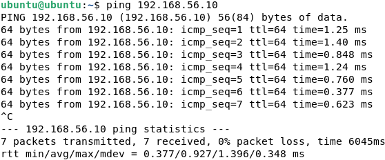

# Cybersecurity Home Lab: SOC Simulation

## Lab Setup 

| Component     | Details                               |
| ------------- | ------------------------------------- |
| Hypervisor    | VirtualBox 7.1.10                     |
| Network Mode  | Internal Network (LabNet)             |
| Kali Linux VM | Attacker — IP: 192.168.56.10          |
| Ubuntu VM     | Target Web Server — IP: 192.168.56.20 |

### Kali Linux
- Version: Kali Linux 2024.4 (64-bit Installer)
- RAM: 2 GB
- Disk: 30 GB (dynamically allocated)
- Tools: nmap, nikto, Metasploit
![[Pasted image 20250709225607.png]]
### Ubuntu Server
- Version: Ubuntu Server 22.04.4 LTS
- RAM: 2 GB
- Disk: 25 GB
- Tools: Wireshark, UFW
- Services:
	- Apache2 (Web Server)
	- OpenSSH Server
![[Pasted image 20250709225943.png]]
#### Adapter Setup
- Adapter 1 (NAT) — eth0 or enp0s3: for internet access
- Adapter 2 (Internal: LabNet) — eth1 or enp0s8: for VM-to-VM communication  
      
### Network Configuration
#### Ubuntu: 
```bash
sudo nano /etc/netplan/00-installer-config.yaml
```
Replaced the file with
```yaml
network:
  version: 2
  ethernets:
    enp0s3:
      dhcp4: true
    enp0s8:
      addresses: [192.168.56.20/24]
      dhcp4: no
```

```bash
sudo netplan apply
```
#### Kali:
```bash
sudo nano /etc/network/interfaces
```
Added
```ini
auto eth0
iface eth0 inet dhcp

auto eth1
iface eth1 inet static
  address 192.168.56.10
  netmask 255.255.255.0
```

```bash
sudo systemctl restart networking
``` 

Confirmed ping connectivity between VMs.

![[screenshots/Pasted image 20250716030046.png]]
