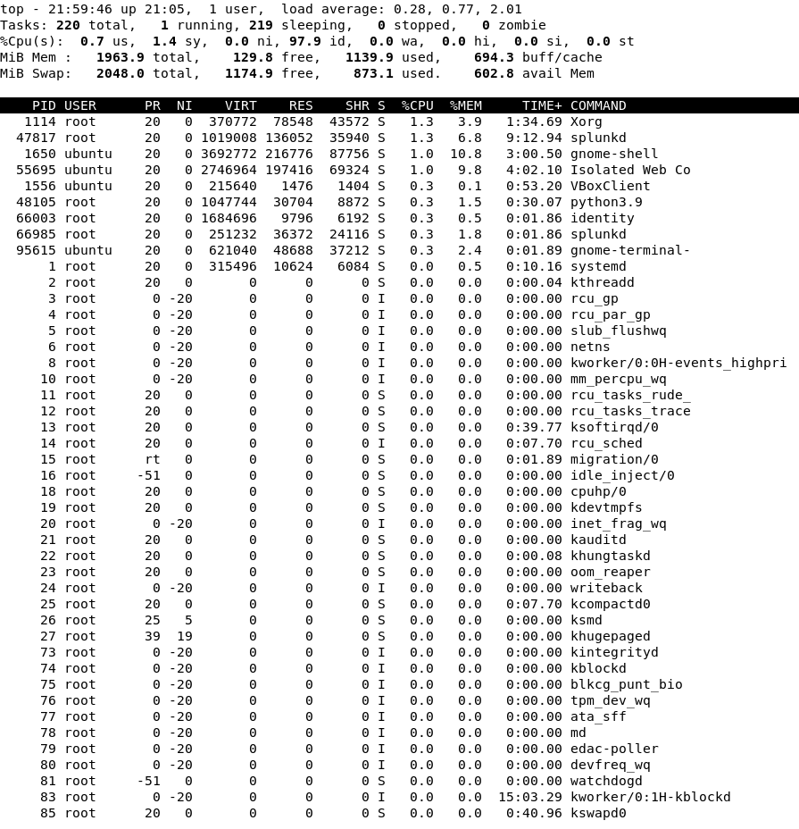
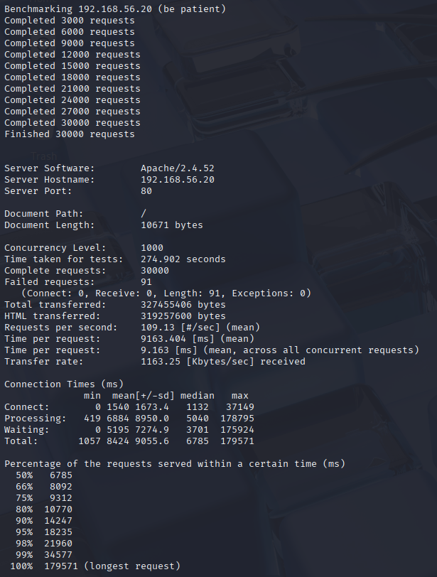
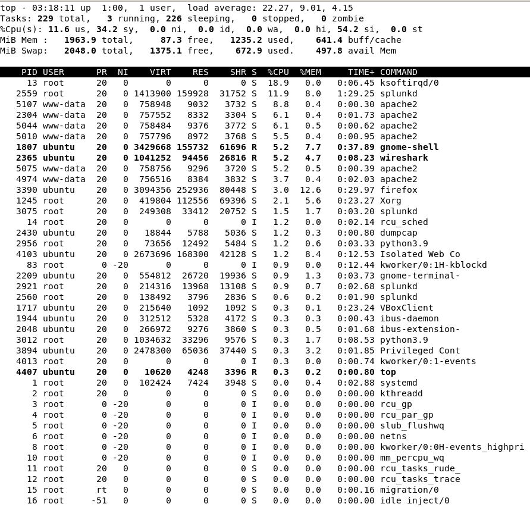
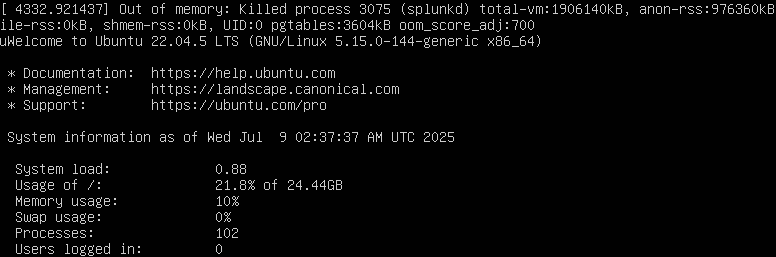

# HTTP Flood Simulation
## Objective
Simulate a Layer 7 (HTTP) Denial of Service (DoS) attack on the internal Ubuntu web server using Apache Benchmark (`ab`) from Kali Linux. Detect the activity using Splunk and observe the impact on network traffic and system resources.

### Notes
- Attacker Machine: Kali Linux (192.168.56.10)   
- Target Machine: Ubuntu Server (192.168.56.20) 
- Rate limiting has not been configured

___
## Pre-Attack
Ran `top` to monitor CPU usage:



___
## Attack Simulation

### Apache Benchmark (`ab`)
```bash
ab -n 1000 -c 50 http://192.168.56.20/
````
- `-n 1000`: Total requests sent
- `-c 50`: 50 concurrent users
- Duration: 1.86 seconds


---

## Detection & Analysis    
### Effect on System Resources
The attack only lasted 1.86 seconds, which didn't allow me to capture a screenshot from the victim machine while it was running. 


#### Observations:
| Process                 | Metric           | Before DoS       | After DoS        | Change       |
| ----------------------- | ---------------- | ---------------- | ---------------- | ------------ |
| **Load Average**        | (1 / 5 / 15 min) | 0.28, 0.77, 2.01 | 0.14, 0.63, 0.97 | Overall drop |
| **splunkd** (PID 47817) | %CPU             | 1.3%             | 8.6%             | +7.3%        |
|                         | %MEM             | 6.8%             | 5.8%             | -1%          |
| **splunkd** (PID 47818) | %CPU             | 0.3%             | 0.3%             | None         |
|                         | %MEM             | 1.8%             | 0.2%             | -1.6%        |

- **splunkd** (PID 47817) had a significant spike in CPU usage, likely due to increased log ingestion
- **Wireshark** was only active in the second snapshot, contributing heavily to CPU and memory usage.
- Load average unexpectedly decreased, indicating that the load from the `ab` command was negligible.
- The DoS was not enough to overwhelm the CPU or crash the server

### Apache Access Logs
Located at `/var/log/apache2/access.log`


- Logs showed rapid GET requests from Kali

### Splunk 
#### Query Used:
```
index=main sourcetype=access_combined clientip="192.168.56.10"
| timechart span=2h count by status
```


#### Observations:
- Spike of 2000 requests at `2025-07-18 22:00
- All status code 200

### Wireshark

#### Filter Used:

```
ip.addr == 192.168.56.10 && http
```


#### Observations:
- Thousands of HTTP GET requests to `/` sent in under 2 seconds
- Packets had `User-Agent: ApacheBench`
- HTTP traffic only from attacker IP

___
## Heavier Attack Simulation
### Pre-Attack


- load average: 4.18, 5.45, 2.72

### `ab` Command Used
```bash
ab -n 30000 -c 1000 http://192.168.56.20/
````
- `-n 30000`: Total requests sent
- `-c 1000: 1000 concurrent users
- Duration: 274.9 seconds



### Detection & Analysis
#### Effect on System Resources
Screenshots taken during the attack:


- Multiple processes from `apache2` appear
- Load average spikes to 22.27, 9.01, 4.15


- Load average reaches a maximum of 49.36, 22.62, 9.75
- Ubuntu VM was noticeably more laggy and became unresponsive when I tried to open Splunk after the attack.

#### Resource Exhaustion 
After the DoS test, the Ubuntu VM froze from running out of memory. I used `Ctrl + Alt + F3` to force terminal access and the kernel's Out-of-Memory (OOM) killer terminated `splunkd` to free resources.



For my home lab, running both Apache and Splunk on the same VM is convenient. But in production environments, Splunk would run on a separate system from the web server.

### Splunk
#### Query Used:
```
index=main sourcetype=access_combined clientip="192.168.56.10"
| timechart span=30m count by status
```


#### Observations:
- Spike of 30000 events in a 30-minute interval 
- Server responded with mostly 200 (successful) and some 408 (delayed) 
- The web server was under strain but able to handle most of the requests

#### Apache Error Logs


Apache's error log captured important events:
- Apache reached its configured `MaxRequestWorkers` limit:
	- `AH00484: server reached MaxRequestWorkers setting
	- `AH10159: server is within MinSpareThreads of MaxRequestWorkers
- These messages confirm that the server became overloaded, limiting its ability to respond to additional connections. This matches the observed HTTP `408` timeout responses.
- Apache later shut down and restarted **gracefully**:
	- `AH00492: caught SIGWINCH, shutting down gracefully
- There was no evidence of forced termination. The Apache web server itself didn't crash even though the VM did, due to system-level memory exhaustion.

---
## Mitigation Ideas
- Use a reverse proxy (e.g., Nginx) for filtering
- Log and block repeat offenders in firewall (e.g., UFW or fail2ban)
