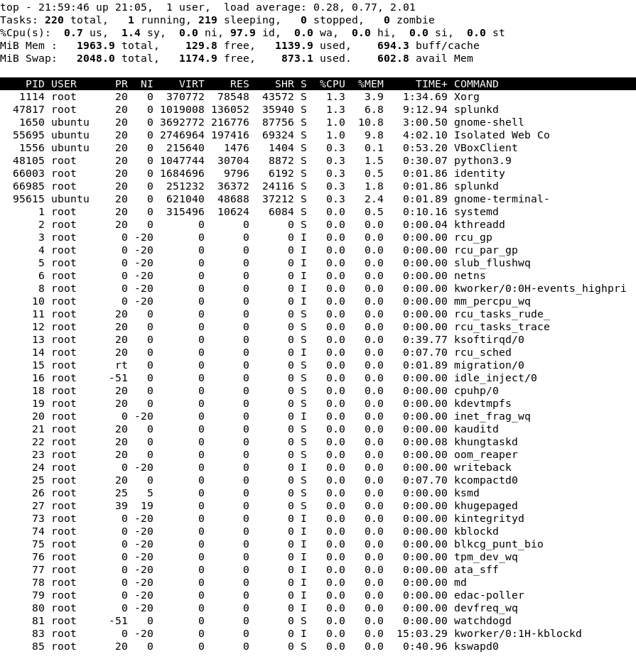

# HTTP Flood Simulation
## Objective
Simulate a Layer 7 (HTTP) Denial of Service (DoS) attack on the internal Ubuntu web server using Apache Benchmark (`ab`) from Kali Linux. Detect the activity using Splunk and observe the impact on network traffic and system resources.

### Notes
- Attacker Machine: Kali Linux (192.168.56.10)   
- Target Machine: Ubuntu Server (192.168.56.20) 
- Rate limiting has not been configured

___
## Pre-Attack
Ran `top` to monitor CPU usage:



___
## Attack Simulation

### Apache Benchmark (`ab`)
```bash
ab -n 1000 -c 50 http://192.168.56.20/
````
- `-n 1000`: Total requests sent
- `-c 50`: 50 concurrent users
- Duration: 1.86 seconds

![[4_2.png]]

---

## Detection & Analysis    
### Effect on System Resources
The attack only lasted 1.86 seconds, which didn't allow me to capture a screenshot from the victim machine while it was running. 

![[4_3.png]]
#### Observations:
| Process                 | Metric           | Before DoS       | After DoS        | Change       |
| ----------------------- | ---------------- | ---------------- | ---------------- | ------------ |
| **Load Average**        | (1 / 5 / 15 min) | 0.28, 0.77, 2.01 | 0.14, 0.63, 0.97 | Overall drop |
| **splunkd** (PID 47817) | %CPU             | 1.3%             | 8.6%             | +7.3%        |
|                         | %MEM             | 6.8%             | 5.8%             | -1%          |
| **splunkd** (PID 47818) | %CPU             | 0.3%             | 0.3%             | None         |
|                         | %MEM             | 1.8%             | 0.2%             | -1.6%        |

- **splunkd** (PID 47817) had a significant spike in CPU usage, likely due to increased log ingestion
- **Wireshark** was only active in the second snapshot, contributing heavily to CPU and memory usage.
- Load average unexpectedly decreased, indicating that the load from the `ab` command was negligible.
- The DoS was not enough to overwhelm the CPU or crash the server

### Apache Access Logs
Located at `/var/log/apache2/access.log`

![[4_4.png]]
- Logs showed rapid GET requests from Kali

### Splunk 
#### Query Used:
```
index=main sourcetype=access_combined clientip="192.168.56.10"
| timechart span=2h count by status
```

![[4_5.png]]
#### Observations:
- Spike of 2000 requests at `2025-07-18 22:00
- All status code 200

### Wireshark

#### Filter Used:

```
ip.addr == 192.168.56.10 && http
```

![[4_6.png]]

#### Observations:
- Thousands of HTTP GET requests to `/` sent in under 2 seconds
- Packets had `User-Agent: ApacheBench`
- HTTP traffic only from attacker IP

___
## Heavier Attack Simulation
### Pre-Attack

![[4_7.png]]
- load average: 1.08, 0.50, 0.21

### `ab` Command Used
```bash
ab -n 30000 -c 1000 http://192.168.56.20/
````
- `-n 30000`: Total requests sent
- `-c 1000: 1000 concurrent users
- Duration: 1.86 seconds

![[4_8.png]]

### Detection & Analysis
#### Effect on System Resources
Screenshots taken during the attack

![[4_9.png]]
- Multiple processes from `apache2`
- load average spikes to 3.45, 1.25, 0.50

![[4_10.png]]
- `apache2` processes don't show up here but load average spikes to 9.37, 3.38, 1.27

### Splunk
#### Query Used:
```
index=main sourcetype=access_combined clientip="192.168.56.10"
| timechart span=1m count by status
```

![[4_11.png]]
#### Observations:
- Spike of 29000+ requests over 2 minutes with status codes 200 (successful), 403 (blocked), and 408 (delayed) 
- Server responded with mostly 403 errors even though rate limiting wasn't configured
- The DoS had a measurable impact on the server

---
## Mitigation Ideas
- Use a reverse proxy (e.g., Nginx) for filtering
- Log and block repeat offenders in firewall (e.g., UFW or fail2ban)
