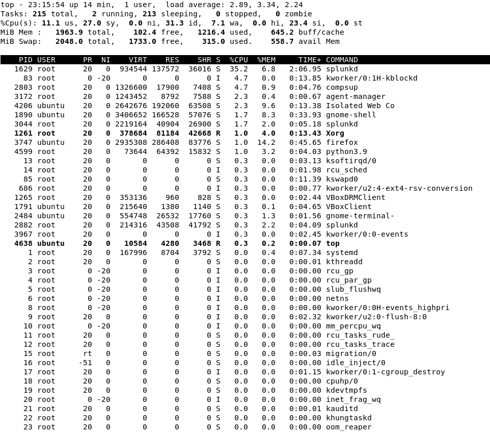
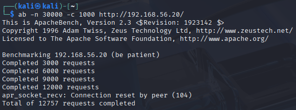
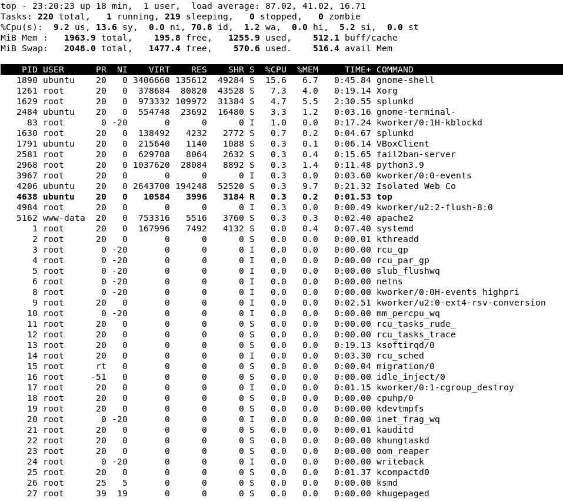
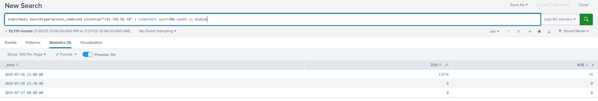
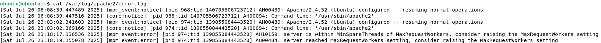
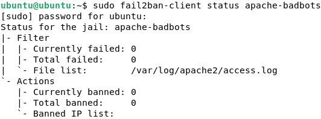
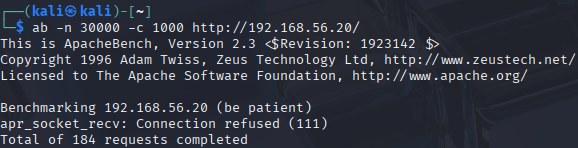
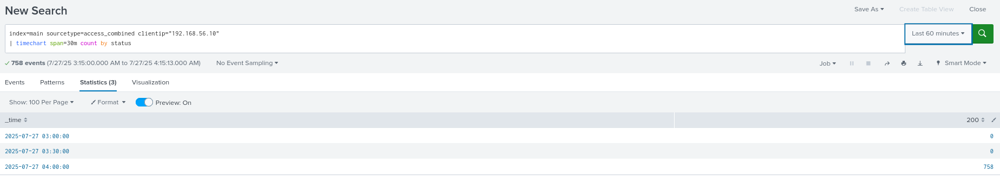
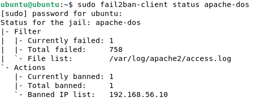

## Mitigation with Fail2Ban

### Objective
To reduce the impact of simulated DoS or brute-force attacks on the Ubuntu web server by setting up **Fail2Ban**, a log-based intrusion prevention system. This helps block malicious IPs that send excessive requests or known bad traffic patterns.

---
### Configuration 
Added the following to `/etc/fail2ban/jail.local`
```
[apache-badbots]
enabled  = true
port     = http,https
logpath  = /var/log/apache2/access.log
maxretry = 3
findtime = 60
bantime  = 600
```
- enabled to detect known malicious user agents
- after 3 matching suspicious requests in 60 seconds, ban the IP for 600 seconds

```
[apache-noscript]
enabled  = true
port     = http,https
logpath  = /var/log/apache2/error.log
maxretry = 3
findtime = 60
bantime  = 600
```
- enabled to detect attempts to access script paths, such as `/cgi-bin` (like during the Nikto web scan)
- after 3 matching suspicious requests in 60 seconds, ban the IP for 600 seconds

**Restarted Fail2Ban**: 
```bash
sudo systemctl restart fail2ban
```
#### Active Jails (verified by `sudo fail2ban-client status`):
These monitor both Apache and SSH traffic.`sshd` is auto-enabled by default.
```
apache-badbots
apache-noscript
sshd
```

---

### Before Mitigation 
- Ran a simulated DoS attack using `ab -n 30000 -c 1000`.
- Observed CPU spike and 30k HTTP requests in Splunk.
- Status codes: 200 (mostly) and some 408
- No IP was blocked.

---
## DoS Test With Mitigation
### Pre-Attack CPU Usage


- load average: 2.89, 3.34, 2.24
### Apache Bench
Used the same command `ab -n 30000 -c 1000 http://192.168.56.20/`


- This time, only 12.7k of the 30k requests were made
- Error: `apr_socket_recv: Connection reset by peer (104)`

### Effect on System Resources


- load average peaks at 87.02, 41.02, 16.71
- This increase is much higher than in the previous DoS test, possibly explaining why the connection was closed early
### Splunk Detection
#### Query Used:
```
index=main sourcetype=access_combined clientip="192.168.56.10"
| timechart span=30m count by status
```


- Again, there is a spike of requests and most of the requests resulted in status code 200 with some 408

### Post-Attack
#### Apache Error Log

- This time, the Apache server reached MaxRequestWorkers like before but did not shut down
- The Ubuntu VM did not freeze or crash 
#### Did Fail2Ban block the attacker?
Command: `sudo fail2ban-client status apache-badbots`

 

- Even though the connection closed early, Kali's IP did not get banned, likely because
	- Apache Bench isn't recognized as a malicious user agent
	- The attack used valid `GET /` requests, not suspicious paths
- The `apr_socket_recv` error may have been Apache closing the connection due to resource exhaustion

---
### 2nd Try: Custom Jail
After default Fail2Ban jails failed to block Apache Bench traffic, I created a custom jail to detect abuse by **frequency of requests** rather than request content.
### apache-dos Filter (`/etc/fail2ban/filter.d/apache-dos.conf`)
```
[Definition] 
failregex = ^<HOST> -.*"(GET|POST) .+ HTTP/.*" 
ignoreregex =
```
- This regex captures any standard HTTP `GET` or `POST` request made to the server
- Meant to detect generic DoS attempts regardless of the tool used (e.g. Apache Bench)
#### Configuration (`jail.local`)
```
[apache-dos]
enabled  = true
port     = http,https
logpath  = /var/log/apache2/access.log
maxretry = 100
findtime = 10
bantime  = 600
```
- After 100 HTTP requests in 10 seconds, ban the IP address for 600 seconds

___
## DoS Test With Custom Jail
### Apache Bench
Used the same command `ab -n 30000 -c 1000 http://192.168.56.20/`

- The DoS ended almost immediately with `apr_socket_recv: Connection refused (111)`

### Detection
#### Splunk


- 758 requests had status 200 responses, indicating the attack was stopped before the server timed out or got overwhelmed
#### Fail2Ban
Command: `sudo fail2ban-client status apache-dos


- After setting up the apache-dos jail, Fail2Ban successfully detected the DoS and the attacker's IP was banned!

