## PART 1: Vulnerability Scan on Ubuntu Server
After identifying exposed services through Nmap and Nikto, a targeted vulnerability scan was performed using Nessus Essentials.
### Objective:
To detect known software vulnerabilities, insecure configurations, and potential exposures on the internal Ubuntu web server.

___
### Nessus Setup (Installed on Kali):
- **Tool**: Nessus Essentials
- **Scan type**: Basic Network Scan
- **Target**: 192.168.56.20 (Ubuntu victim server)
- **Scope**: All open ports and services

### Detection of Vulnerability Scan
During the vulnerability scan with Nessus, the Ubuntu server's custom Fail2Ban jail (`apache-dos`) automatically detected high-frequency HTTP requests and temporarily banned the attacker's IP (Kali Linux).

This indicates that the DoS detection rule was sensitive enough to be triggered by automatic scanning behavior. With this rule, Ubuntu is able to defend itself against aggressive reconnaissance or bot activity.

But for my controlled lab, I wanted a complete scan so I unbanned Kali's IP with `sudo fail2ban-client set apache-dos unbanip 192.168.56.10` and disabled Fail2Ban. I then restarted the scan since the ban likely interfered with the scan's ability to complete all checks

#### Results:

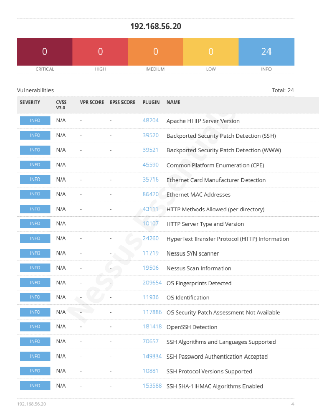
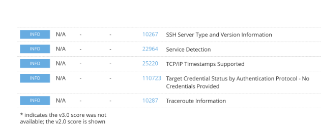

- 24 informational-level vulnerabilities
- These aren't proven vulnerabilities but can enable an attack, e.g. SSH password authentication could allow brute-force attacks
- No critical, high, or medium level findings, which is expected for a minimal web server

___
## PART 2: DVWA Setup on Ubuntu
To simulate real-world web application vulnerabilities, the Damn Vulnerable Web Application (DVWA) was installed on the internal Ubuntu web server. Its security level was set to Low to allow vulnerability testing.

### Unauthenticated Nessus Scan of DVWA
**Target**: `192.168.56.20`  
**Scan Type**: Web Application Tests  
**Credentials**: None
#### Results:

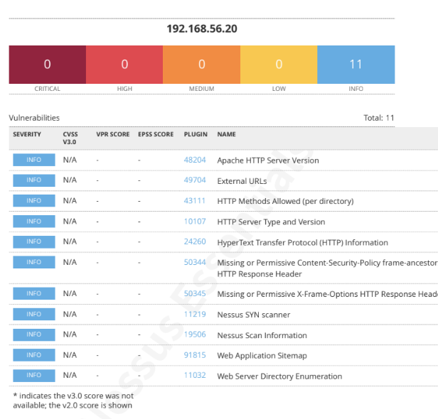
- 11 findings, all informational
- Detected:
    - Apache version and HTTP headers
    - Allowed HTTP methods
    - DVWA directory path
- Did **not** detect:
    - SQLi, XSS, command injection, or file upload issues
    - Any CVEs or critical findings
        
This is expected since DVWA requires login to access vulnerabilities. Since I set up the web app, I already know the login credentials but in a real scenario the attacker usually wouldn't. The next steps are to simulate an unauthorized login, run an authenticated scan, and perform attacks from Kali's end.

___
## PART 3: Access DVWA From Kali 
### Objective
Simulate unauthorized login using SQL injection or brute force to access the DVWA web app without valid credentials. Observe and document the attack path from the perspective of a remote attacker.
#### Environment
- **Target**: Ubuntu server running DVWA (security level: Low)
- **Attacker**: Kali Linux VM

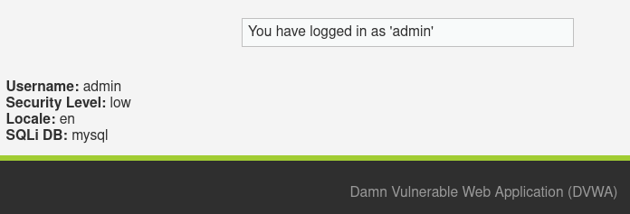
---

### SQL Injection `login.php` Bypass
#### Note on DVWA Session Behavior
The DVWA security level is stored in the user’s PHP session, meaning it must be set separately for each browser or client. During testing, I tried several SQLi credentials on Kali which failed, then logged in with the actual credentials. The security level was "Low" in Ubuntu (the server) but appeared as "Impossible" in Kali (the attacker VM), so I had to manually change it to "Low" after logging in on Kali, then logged out.
#### Credentials Tried
- Usernames: 
	- `' or '1'='1`
	- `admin' --
	- `admin') --
	- `admin' #`
- Password: can be anything, since the SQL code in the username tells MySQL to ignore the password
### Result

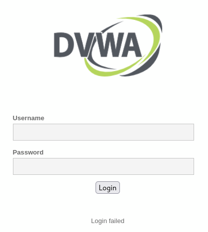
SQLi to bypass login failed in Low mode, possibly due to modified behavior on the login page.

### Detection 
#### Wireshark
Filter: `http.request.method == "POST" && http.request.uri contains "login.php"

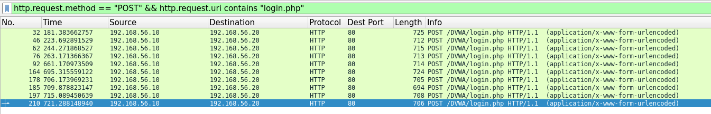
Here we can see the login attempts made by Kali. 

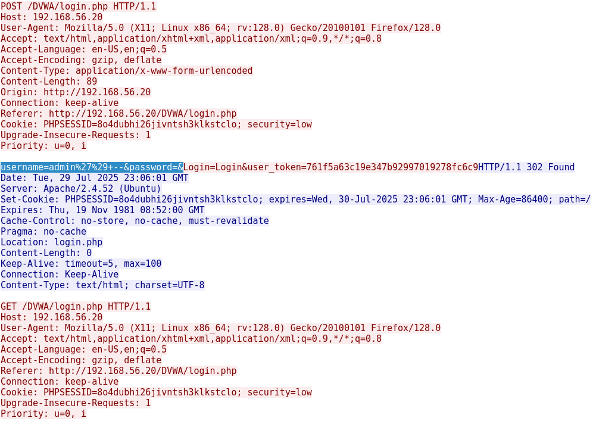
`Right click on a packet -> Follow -> HTTP Stream` brings up the suspicious credentials used, which are highlighted in the screenshot.

___
### Brute-Force Login Simulation (Hydra)
Since SQL injection failed in the login form, a credential attack was simulated using Hydra.

Hydra command used: 
```bash
hydra -l admin -P /usr/share/wordlists/rockyou.txt 192.168.56.20 http-post-form "/DVWA/login.php:username=^USER^&password=^PASS^:Login failed"
```
Flags
- `-l admin`: Try username “admin” (known default)
- `-P`: Use rockyou.txt as password wordlist
- `Login failed`: Text on the page when login fails
- `/DVWA/login.php`: Target login path

This command sent password guesses for the "admin" user until a valid login was discovered.

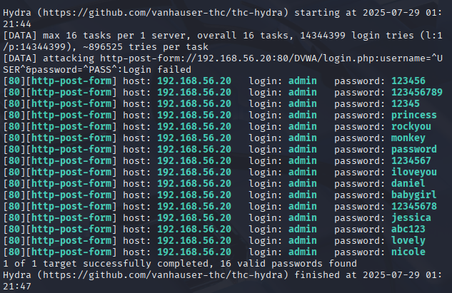
Hydra reported 16 "valid" passwords, but only one is correct: `admin / password`. The remaining results were false positives, possibly due to the login form not clearly returning a consistent failure message.

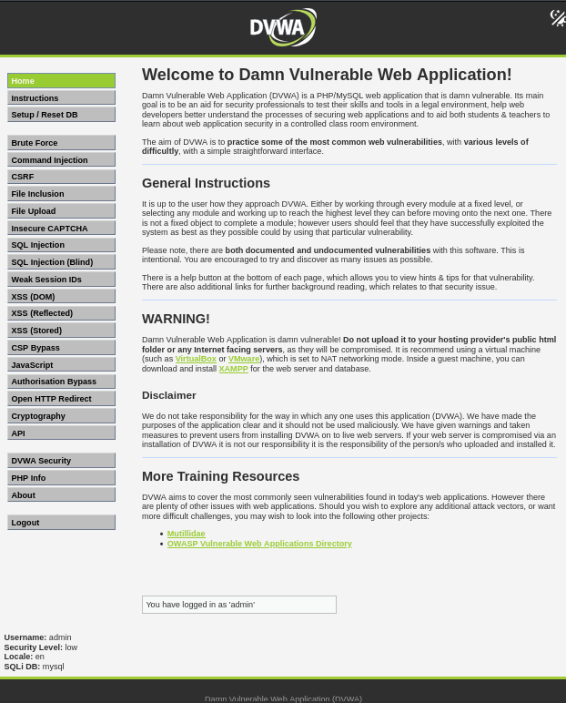
### Detection
#### Splunk
Query:
```
source="/var/log/apache2/access.log" login.php
```
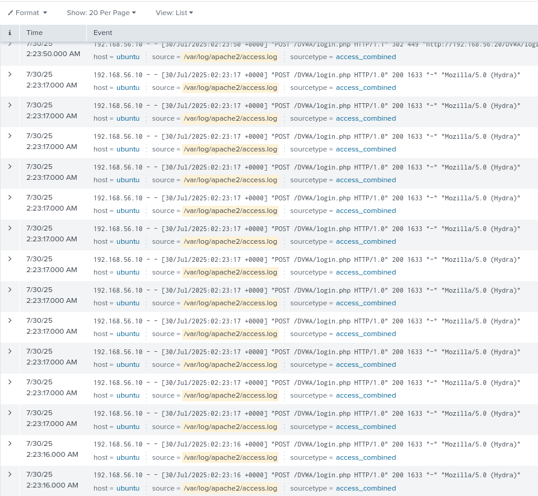
- Many login attempts from the same IP with user agent `Mozilla/5.0 (Hydra)`

Query:
```
source="/var/log/apache2/access.log" login.php
| stats count by clientip
```
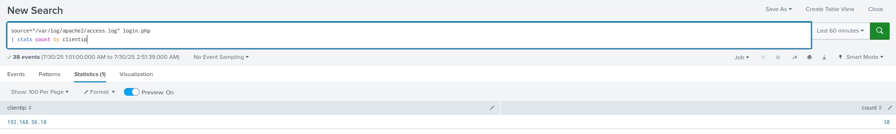
- The attacker IP  attempted to login 38 times in the past hour

___
## PART 4: Authenticated Vulnerability Scan From Kali
### Nessus
**Target**: `192.168.56.20`  
**Scan Type**: Web Application Tests  
**Credentials**: 
- Authentication method: HTTP login form
- Username: `admin
- Password: `password`
- Login page: `/DVWA/login.php`
- Login submission page: `/DVWA/login.php`
- Login parameters: `username=admin&password=password&Login=Login`
- Check authentication on page: `/DVWA/index.php`
- Regex to verify successful authentication: `Welcome to Damn Vulnerable Web Application`
#### Result
Nessus failed to authenticate and 12 info-level vulnerabilities were found. 

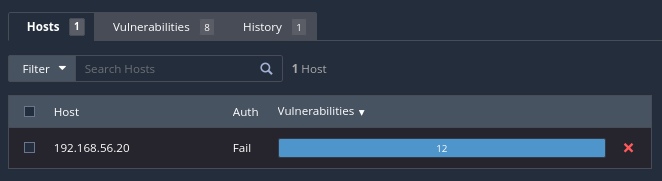
Upon inspecting a packet of a successful login to DVWA, it appears that tools like Nessus and Hydra failed to login due to DVWA’s CSRF protection and session handling.

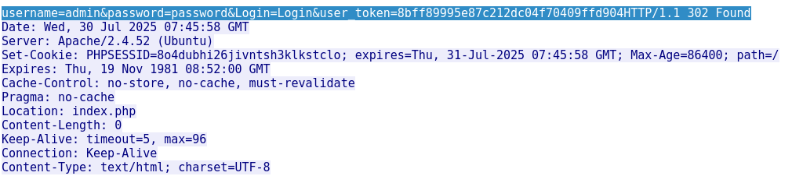

### OWASP ZAP
Nessus scans are more targeted to network-layer vulnerabilities, so I switched to OWASP ZAP to evaluate application-layer vulnerabilities.
#### Steps
1. Selected **Manual Explore Mode** and **Attack Mode
2. Launched browser and logged into DVWA using default credentials (`admin:password`).
3. Due to system resource constraints, I only clicked into the following challenge pages: Brute Force, Command Injection, XSS (Reflected), SQLi, File Upload, and CSFR
4. Right-clicked `vulnerabilities` under the site tree and selected Attack->Active scan

#### Results
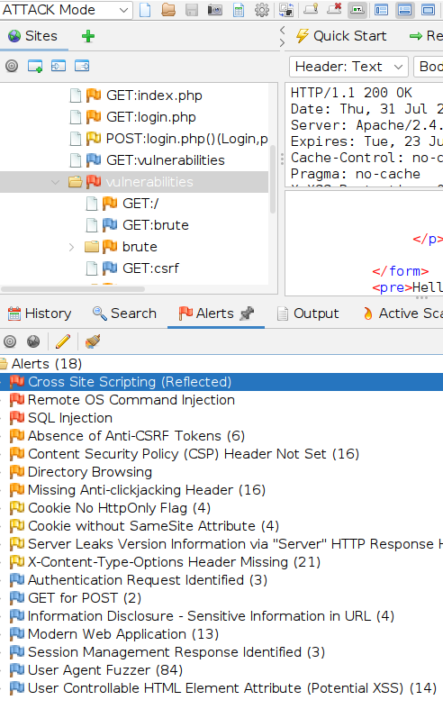
The ZAP scan produced 18 alerts in total. 

**High-Risk Vulnerabilities**
 1. **Cross Site Scripting (Reflected)**
	- **URL**: `/DVWA/vulnerabilities/xss_r/`
	- **Exploit**: Injected `<script>alert(1);</script>`, which was reflected in the HTML response.
2. **Remote OS Command Injection**
	- **URL**: `/DVWA/vulnerabilities/exec/`
	- **Exploit**: The scan rule was able to retrieve the content of a file or command by sending `&cat /etc/passwd&` to the operating system running this application.
3. **SQL Injection**
	- **URL**: `/DVWA/vulnerabilities/sqli/`
	- **Exploit**: The page results were manipulated using the boolean conditions `' AND '1'='1' -- ` and `' OR '1'='1' -- `

 **Medium & Low Risk Vulnerabilities**
- **Absence of Anti-CSRF Tokens** – Many forms lack CSRF protection.
- **Directory Browsing** – Hidden files and directories can be accessed to read sensitive information.
- **Missing Security Headers**:
    - `Content-Security-Policy` not set.
    - `X-Content-Type-Options` missing.
    - `X-Frame-Options` missing.
- **Cookies Missing Flags**:
    - `HttpOnly` and `SameSite` attributes not set, exposing cookies to theft via client-side scripts.

### Detection
#### Splunk

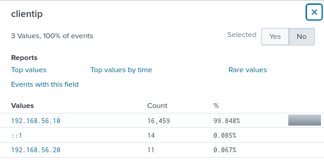
Clicking `interesting fields -> clientip` shows that Kali's IP made over 16k requests.

**Query for checking URL parameters:**
```
index=main sourcetype=access_combined uri_query!=""
| stats count by uri_query
| sort -count
```
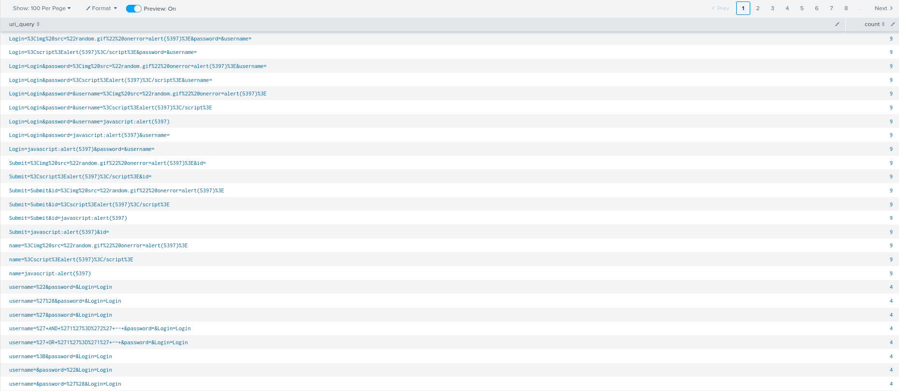
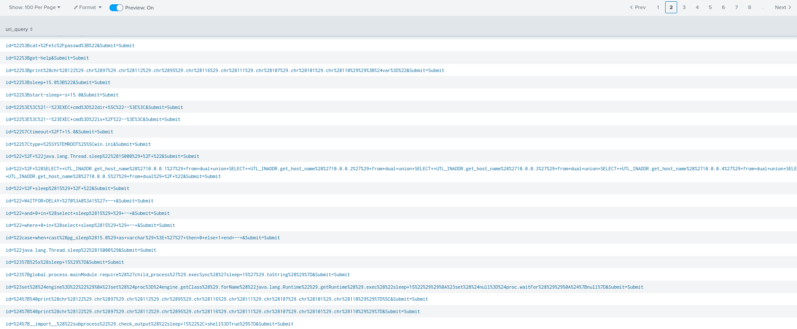
Many query strings contained symbols indicating
- Cross-site scripting: `%3C` (`<`), `%3E` (`>`), `script`, `alert(` 
- SQL injection: `%27` (`'`), `--`, logical operators (e.g. `OR`), SQL commands (e.g. `SELECT`) 
- Command injection: `cmd`, `EXEC`, `SYSTEMROOT` 
